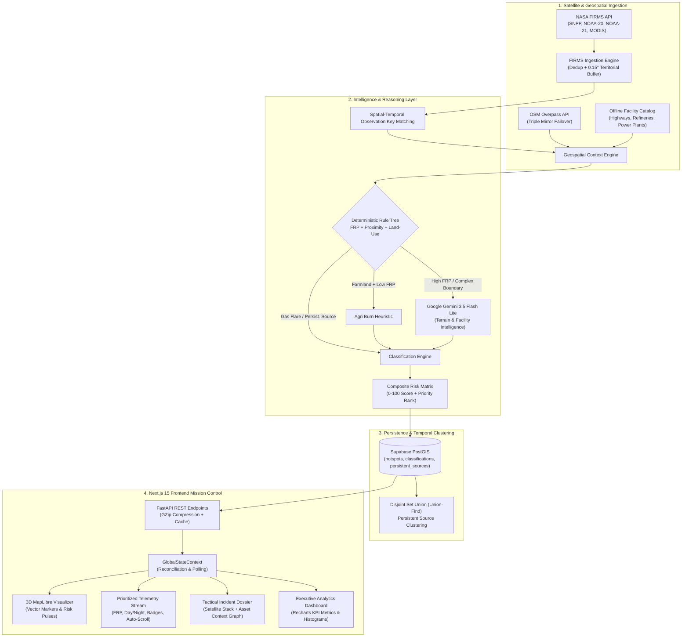

# 🛰️ VERTEX — Autonomous AI Geospatial Thermal Intelligence Platform

<p align="center">
  
  
  
  
  
  
  
</p>

---

## 📌 Executive Summary

**VERTEX** is an autonomous, mission-critical thermal surveillance and geospatial classification platform engineered for **Smart India Hackathon (SIH 2026) Problem Statement 26162** for the **National Technical Research Organisation (NTRO)**.

Thermal anomalies detected by earth observation satellites routinely misclassify benign biomass combustions (e.g. agricultural stubble burns, forest fires) and routine industrial flares as emergency industrial fires, overloading surveillance operators. **VERTEX** solves this through a multi-tiered ingestion, geospatial reasoning, and AI classification pipeline:

1. **Multi-Constellation Ingestion**: Queries 4 NASA satellite constellations concurrently (`VIIRS_SNPP_NRT`, `VIIRS_NOAA20_NRT`, `VIIRS_NOAA21_NRT`, and `MODIS_NRT`) covering all passes over the Indian subcontinent and maritime EEZ.
2. **Geospatial Contextualization**: Integrates dynamic OpenStreetMap (OSM) Overpass queries with automated mirror failover, an offline high-density industrial facility catalog, and a 16km buffered territorial boundary filter.
3. **Multi-Model AI Classification**: Combines low-latency deterministic geospatial heuristics with **Google Gemini AI** for natural vegetation, agricultural land-use, and industrial perimeter reasoning.
4. **Persistent Anomaly Clustering**: Employs Disjoint-Set Union (Union-Find) algorithms across temporal windows to identify and track continuous industrial thermal emissions (refineries, steel plants, power stations).
5. **Operational Command Dashboard**: Built with Next.js 15, Tailwind CSS, MapLibre GL 3D mapping, Sentinel-2/Esri high-res satellite evidence stacks, and an interactive asset graph inspector.

---

## 🏛️ System Architecture



---

## 🔬 Core Capabilities & Innovations

### 1. Multi-Satellite Ingestion Engine
- **Constellation Aggregation**: Instead of relying on a single satellite pass, VERTEX queries all 4 operational sensor constellations concurrently via `asyncio.gather`.
- **Territorial Buffer & Offshore EEZ**: Incorporates a high-fidelity boundary polygon buffered by `0.15°` (~16 km) to monitor critical maritime energy assets (e.g. Bombay High offshore platforms, KG Basin) and border agricultural zones without boundary drop-off.
- **De-duplication**: Identifies overlapping observations using sub-kilometer spatial-temporal hashing (`lat|lon|acq_date|acq_time|satellite`).

### 2. Geospatial Contextualization & Failover
- **Overpass Triple-Mirror Failover**: Evaluates primary, secondary, and tertiary mirrors (`overpass-api.de`, `overpass.kumi.systems`, `openstreetmap.ru`) with strict 4.0s timeouts.
- **Strict Proximity Thresholds**: Facilities are strictly verified within a `<= 1000m` physical footprint. Unrealistic macro-polygons (e.g., thousands of meters away) are rejected.
- **Hydrological Safeguards**: Waterway and reservoir detection (`<150m`) prevents classifying coastal flares or agricultural burns in floodplains as wildfires.

### 3. AI Reasoning Pipeline (Google Gemini)
- **Model**: Powered by Google Gemini (`gemini-3.5-flash-lite` / `gemini-3.8-flash`) via the modern `google-genai` SDK.
- **Context Injection**: Gemini receives structured spatial geometry: distance to nearest facility, facility type, land-use classifications (farmland, forest, industrial, residential), sensor FRP, brightness temperature, satellite instrument, and day/night pass.
- **Dynamic Evidence & Explanations**: Produces human-interpretable technical rationales with bulleted sensor evidence for defense and environmental operators.

### 4. Classification Taxonomy & Risk Matrix

| Classification Type | Indicator Criteria | Visual Marker | Risk Level |
|---|---|---|---|
| **Industrial Fire** | Acute high FRP near or inside verified industrial/power infrastructure | 🔴 Red (`#dc2626`) | **CRITICAL / HIGH** |
| **Persistent Industrial Source** | Recurrent thermal emissions, moderate FRP, direct industrial alignment | 🟠 Deep Orange (`#ea580c`) | **MODERATE** |
| **Gas Flare** | Flare stacks, refineries, petrochemical plants, FRP > 50 MW within 500m | 🟡 Amber (`#f59e0b`) | **HIGH / MODERATE** |
| **Wildfire / Forest Fire** | Natural vegetation/forest reserves, high biomass FRP, isolated from industry | 🟢 Green (`#16a34a`) | **HIGH / MODERATE** |
| **Agricultural Burn** | Verified farmland/cropland, low-to-moderate FRP, daytime pass, clear of facilities | 🟨 Yellow (`#ca8a04`) | **LOW** |
| **Mining Thermal Activity** | Verified open-cast mines, quarries, metallurgical processing | 🟣 Violet (`#7c3aed`) | **MODERATE** |
| **Unclassified / Pending** | Incoming raw observation undergoing enrichment and verification | ⚪ Gray (`#9ca3af`) | **LOW** |

### 5. Persistent Source Tracking (Union-Find Clustering)
- Computes connected components using Disjoint-Set Union (Union-Find) with spatial grid indexing (`O(N * α(N))`).
- Automatically clusters recurring thermal events active across 3+ distinct days within a 1,000-meter radius, distinguishing continuous factory furnaces from sporadic emergency blazes.

---

## 💻 Tech Stack

| Layer | Technologies |
|---|---|
| **Frontend Framework** | Next.js 15.0 (App Router), React 18, TypeScript |
| **Styling & Icons** | Tailwind CSS 3.4, Material Symbols Outlined, Google Fonts (Space Grotesk, Inter, JetBrains Mono) |
| **Mapping & Geospatial** | MapLibre GL JS, Mapbox GL Draw, Shapely, GeoJSON |
| **Data Visualization** | Recharts (ResponsiveContainer, BarChart, PieChart) |
| **Backend Framework** | FastAPI (Python 3.12+), Uvicorn (ASGI), Pydantic v2 |
| **AI & NLP** | Google Gemini SDK (`google-genai`), JSON mode generation |
| **Database & Cache** | Supabase (PostgreSQL 15 + PostGIS), In-Memory LRU Cache |
| **Middleware & Security** | SlowAPI (Rate Limiting), CORS, GZip Compression, HTTP Bearer Auth |

---

## 🚀 Quick Start Guide

### Prerequisites
- **Python 3.12+**
- **Node.js 20+** and **npm**
- Active NASA FIRMS MAP Key ([Get Free Key](https://firms.modaps.eosdis.nasa.gov/api/map_key/))
- Supabase Project ([Supabase](https://supabase.com/))
- Google AI Studio Gemini API Key ([Get Gemini Key](https://aistudio.google.com/))

---

### Backend Setup

1. **Navigate to the backend directory**:
   ```bash
   cd backend
   ```

2. **Create and activate a virtual environment**:
   ```bash
   python -m venv venv
   # On Windows (PowerShell):
   .\venv\Scripts\Activate.ps1
   # On Linux/macOS:
   source venv/bin/activate
   ```

3. **Install dependencies**:
   ```bash
   pip install -r requirements.txt
   ```

4. **Configure Environment Variables**:
   Create a `.env` file in `backend/` (refer to `.env.example`):
   ```env
   FIRMS_MAP_KEY="your-nasa-firms-key"
   SUPABASE_URL="https://your-project.supabase.co"
   SUPABASE_ANON_KEY="your-supabase-anon-key"
   SUPABASE_SERVICE_KEY="your-supabase-service-role-key"
   GEMINI_API_KEY="your-gemini-api-key"
   GEMINI_MODEL="gemini-3.5-flash-lite"
   CORS_ORIGINS="http://localhost:3000"
   ```

5. **Run Database Migrations**:
   Execute the migration SQL scripts located in `backend/db/migrations/` in your Supabase SQL editor:
   - `001_initial_schema.sql`
   - `002_postgis_indexes.sql`
   - `006_schema_alignment.sql`

6. **Start the FastAPI Backend**:
   ```bash
   uvicorn main:app --reload --port 8000
   ```
   *The interactive Swagger documentation will be available at [http://localhost:8000/docs](http://localhost:8000/docs).*

---

### Frontend Setup

1. **Navigate to the frontend directory**:
   ```bash
   cd ../frontend
   ```

2. **Install Node packages**:
   ```bash
   npm install
   ```

3. **Configure Environment Variables**:
   Create a `.env.local` file in `frontend/`:
   ```env
   NEXT_PUBLIC_API_URL="http://localhost:8000"
   NEXT_PUBLIC_SUPABASE_URL="https://your-project.supabase.co"
   NEXT_PUBLIC_SUPABASE_ANON_KEY="your-supabase-anon-key"
   ```

4. **Start the Next.js Development Server**:
   ```bash
   npm run dev
   ```
   *Open [http://localhost:3000](http://localhost:3000) to view the Mission Control interface.*

---

## 📡 API Reference Overview

| Method | Endpoint | Description |
|---|---|---|
| `GET` | `/health` | High-level system & database operational status (returns 503 if degraded) |
| `GET` | `/api/v1/health` | Verbose service telemetry (FIRMS, OSM, Gemini, Database) |
| `GET` | `/api/v1/firms/realtime` | Returns real-time NASA FIRMS observations as GeoJSON FeatureCollection |
| `GET` | `/api/v1/hotspots/classified` | Returns classified hotspots with full AI explanation and OSM context |
| `GET` | `/api/v1/hotspots/persistent-sources` | Returns temporally clustered persistent industrial thermal sources |
| `POST`| `/api/v1/osm/enrich/{id}` | Forces live OSM Overpass + Gemini re-evaluation of a specific hotspot |
| `POST`| `/api/v1/osm/enrich/top50` | Concurrently enriches top 50 highest-FRP thermal anomalies via Semaphore throttling |
| `GET` | `/api/v1/satellite/evidence` | Retrieves high-resolution optical / Sentinel-2 evidence tiles for target coordinates |
| `GET` | `/api/v1/analytics/summary` | Aggregated statistical metrics (counts, mean FRP, regional breakdowns) |

---

## 🧪 Testing & Verification

### Automated Test Suite
To run the automated backend test suite covering classifier heuristics, Overpass query parsers, distance bounds, and persistence algorithms:
```bash
# From workspace root:
python -m unittest discover -s backend -p "test_*.py"
```

### TypeScript Static Analysis
To run zero-error type checking on all frontend pages, components, and API clients:
```bash
# From frontend directory:
node ./node_modules/typescript/bin/tsc --noEmit
```

---

## 🛡️ Security & Operational Integrity

- **Zero Credential Leakage**: No private keys or service roles are bundled into frontend client packages.
- **Fail-Safe Offline Catalog**: When external Overpass API endpoints face network disruption or rate-limits, VERTEX automatically falls back to an internal offline geospatial catalog without failing the ingestion loop.
- **PostgREST Query Pushdown**: Queries apply server-side bounding and index limits (`limit`, `frp` filters), preventing database performance bottlenecks.
- **Payload Compression**: Native `GZipMiddleware` reduces GeoJSON transmission payload sizes by up to 85%.

---

## 👥 Contributors & Attribution

Developed for **Smart India Hackathon 2026** under **Problem Statement 26162** for the **National Technical Research Organisation (NTRO)**.
Thermal anomaly data provided courtesy of **NASA FIRMS / LANCE**. Infrastructure data provided by **OpenStreetMap Contributors**. AI Reasoning provided by **Google Gemini**.
